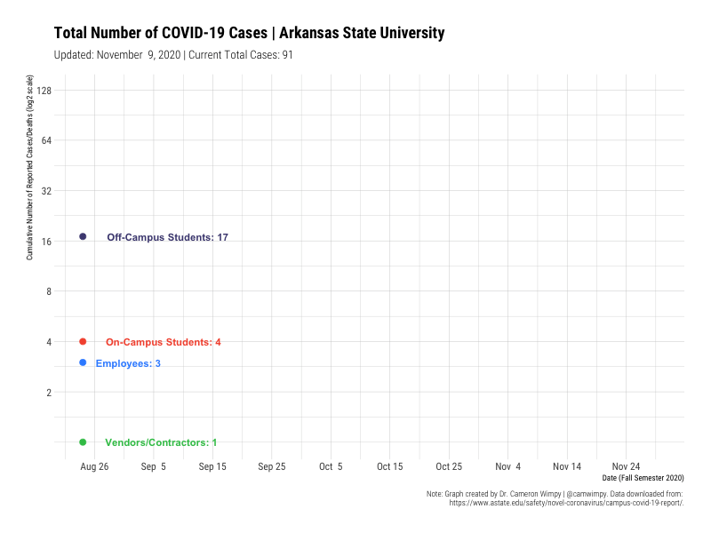
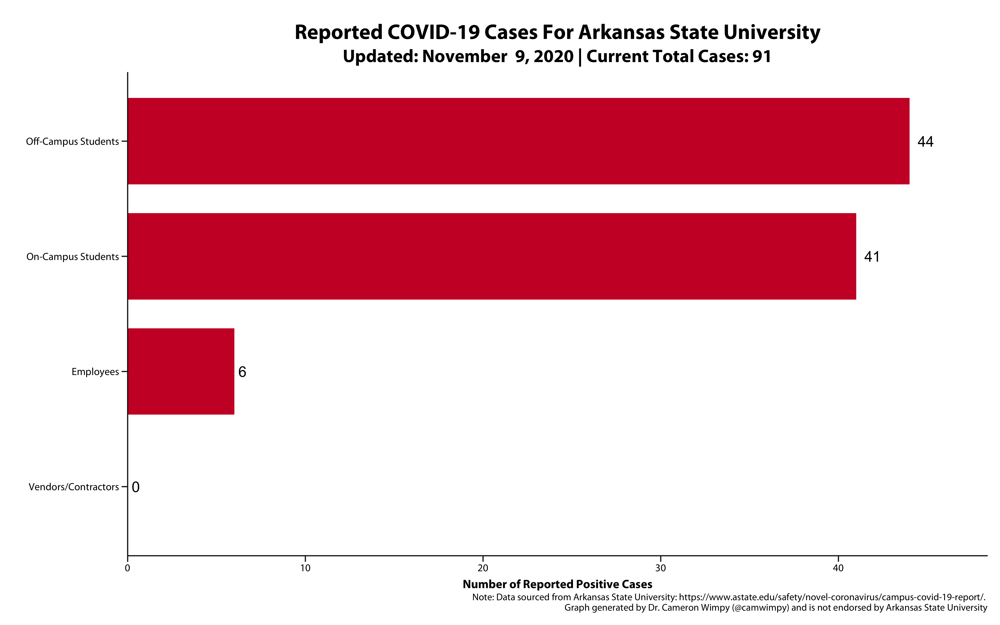

# ReadMe

This repo is dedicated to making graphs to track the Covid-19 outbreak at Arkansas State University. The R code is fully automated and just needs to be run each day to update the data and create the plots. No manual modifications are needed.

## Running Total

## Daily Snapshot

## Updated: November 11, 2020